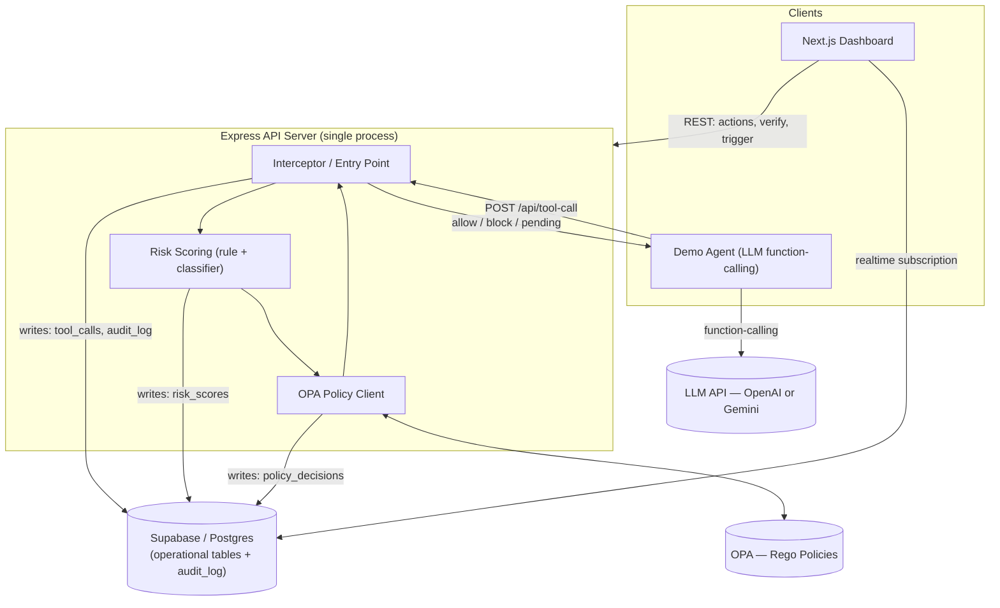

# AgentGuard

A policy-enforcement gateway that sits between an AI agent's decision to call a tool and the tool actually running. Every proposed action is intercepted, scored for risk, checked against policy, and allowed, blocked, or sent to a human for approval — with every decision written to a tamper-evident log and shown live on a dashboard.

Built as a time-boxed academic project (16-week plan, live demo/viva). That framing matters throughout this README — several design choices exist to make the project defensible and demoable, not production-ready. Where that's true, it's stated directly rather than glossed over.

---

## Table of Contents

- [What it does](#what-it-does)
- [Architecture](#architecture)
- [Tech stack](#tech-stack)
- [Repository structure](#repository-structure)
- [Database schema](#database-schema)
- [API reference](#api-reference)
- [Pages / routes](#pages--routes)
- [Getting started](#getting-started)
- [Environment variables](#environment-variables)
- [Demo mode](#demo-mode)
- [Testing](#testing)
- [Known limitations](#known-limitations)
- [Project phases](#project-phases)
- [Open questions](#open-questions)
- [Report / documentation structure](#report--documentation-structure)

---

## What it does

1. An agent (or a canned demo scenario) proposes a tool call — send email, delete a file, run a DB query, hit a payment API.
2. AgentGuard intercepts the call before anything real happens.
3. A risk score is computed: a rule-based checklist (destructive actions, sensitive targets, odd timing/frequency score higher) combined with a small trained prompt-injection classifier (TF-IDF + logistic regression).
4. OPA (Open Policy Agent), running Rego policies, takes the score plus metadata and returns one of three decisions: **allow**, **block**, or **approve** (send to a human).
5. If `approve`, the pipeline pauses (via polling with a timeout-to-deny) until an admin resolves it from the dashboard.
6. Every event — regardless of outcome, including rejected/malformed requests — is written to a hash-chained audit log. A verifier can walk the chain and flag any row that's been altered.
7. A Next.js dashboard shows all of this live: activity feed, pending approvals, call detail with score breakdown, and an audit log with a one-click integrity check.

**Core loop:** `intercept → score → policy decision → (optional human approval) → tamper-evident log → live dashboard`

---

## Architecture



**Design principles:**
- **One decision authority.** OPA is the single place a final allow/block/approve decision is made. The risk score is an *input* to policy, not a competing decision-maker — scoring math lives in the Risk Scoring module, never in Rego.
- **One process boundary.** The backend is a single Express process with three in-process modules (Interceptor, Risk Scoring, Policy Client) — not separate microservices. There's no scale justification for splitting them at this project's size (20–30 call bursts).
- **No infrastructure the scope doesn't need.** No Kafka, no message queue, no caching layer. Adding any of these would be complexity the requirements never asked for.
- **Two trust boundaries into the data, by design (and flagged as a risk).** The dashboard reads live state two ways: REST calls to the backend for actions (approve/reject, verify, trigger), and a **direct Supabase realtime subscription** for live table updates, bypassing the backend entirely. This is an intentional shortcut for demo speed, not an oversight — but it means authorization isn't uniformly enforced through one layer. See [Known limitations](#known-limitations).

---

## Tech stack

| Layer | Technology | Why |
|---|---|---|
| Frontend | Next.js + Tailwind CSS | Fast to build a small multi-page dashboard; clean Supabase client integration |
| Backend | Express (Node.js) | Minimal, sufficient for a single-process API at this scale |
| Database | Supabase (Postgres) | Managed Postgres + built-in realtime + basic auth primitives in one free-tier service |
| Policy engine | OPA / Rego | Real, industry-used policy tool — not an ad hoc if/else rules engine |
| Demo agent | OpenAI **or** Gemini function-calling (pick one) | Either is sufficient; maintaining both integration paths has no product benefit |
| Language | TypeScript (recommended) | Not mandated by the source spec, but recommended for anything beyond a solo throwaway script |

---

## Repository structure

```
agentguard/
├── apps/
│   ├── dashboard/              # Next.js app
│   │   ├── app/
│   │   │   ├── login/
│   │   │   ├── (dashboard)/
│   │   │   │   ├── page.tsx            # / — Overview
│   │   │   │   ├── activity/
│   │   │   │   ├── approvals/
│   │   │   │   ├── calls/[id]/
│   │   │   │   ├── audit-log/
│   │   │   │   └── demo/
│   │   ├── components/
│   │   │   ├── StatusBadge.tsx
│   │   │   ├── RiskMeter.tsx
│   │   │   ├── ApprovalCard.tsx
│   │   │   ├── LogTable.tsx
│   │   │   ├── IntegrityCheckButton.tsx
│   │   │   ├── ScenarioTriggerButton.tsx
│   │   │   └── LiveFeedRow.tsx
│   │   └── lib/                # Supabase client, REST client
│   │
│   └── api/                    # Express backend
│       ├── src/
│       │   ├── interceptor/    # POST /api/tool-call entry point
│       │   ├── scoring/        # rule-based scorer + injection classifier
│       │   ├── policy/         # OPA client
│       │   ├── approvals/      # approval CRUD + timeout poller
│       │   ├── audit/          # hash-chain writer + verifier
│       │   ├── auth/           # admin session + agent API key middleware
│       │   └── routes/
│       └── policies/           # Rego policy files, loaded by OPA
│
├── demo-agent/                 # standalone LLM function-calling client + 3–4 mocked tools
├── db/
│   ├── migrations/             # numbered, forward-only SQL migrations
│   └── seed/                   # seed script (agents, admins, historical calls, valid hash chain)
├── docs/                       # PRD, TRD, DB schema spec, UI/UX spec, web app flow, this plan
└── README.md
```

Adjust to taste — the point is the module boundaries above (interceptor / scoring / policy / approvals / audit / auth), not the exact folder names.

---

## Database schema

Eight tables. `admins` and `admin_sessions` aren't in the original architecture sketch — they were added because the admin login requirement (`/login`) can't be implemented against nothing.

| Table | Purpose | Key relationships |
|---|---|---|
| `agents` | Identity for API callers (hashed API key) | 1 agent → many `tool_calls` |
| `admins` | Dashboard operator credentials | 1 admin → many `admin_sessions`, many `approvals` (as reviewer) |
| `admin_sessions` | Issued login sessions (so they can expire/be revoked) | many → 1 `admins` |
| `tool_calls` | One row per proposed action — the hub table | 1 → 0..1 each of `risk_scores`, `policy_decisions`, `approvals` |
| `risk_scores` | `rule_score`, `injection_score` (nullable), `final_score` | 1:1 with `tool_calls` |
| `policy_decisions` | OPA's decision + which policy fired | 1:1 with `tool_calls` |
| `approvals` | Human review record; `pending → approved / rejected / timeout_denied`, one-way transition | 0:1 with `tool_calls` |
| `audit_log` | Append-only, hash-chained event stream | Deliberately **not** foreign-keyed to `tool_calls` — integrity comes from hashing, not relational structure |

**Write rules:**
- `tool_calls`, `risk_scores`, `policy_decisions` are write-once — never updated after creation.
- `approvals` is the one table with a real update path (`status`, `reviewer_id`, `resolved_at`).
- `audit_log` is never updated or deleted, by anyone, ever. This should be enforced at the **database level** (`REVOKE UPDATE, DELETE`), not just by omitting the code path — an app-layer-only guarantee can be broken by a bug, not just an attacker.

Full column definitions, indexes, and RLS discussion live in `docs/AgentGuard_Backend_DB_Schema.md`.

---

## API reference

All endpoints are JSON in/out. Agent endpoints use a hashed API key; everything else requires an admin session.

| Method & Path | Auth | Purpose |
|---|---|---|
| `POST /api/tool-call` | Agent key | Submit a proposed action → returns `{ decision, call_id, reason }` |
| `GET /api/tool-calls` | Admin | List calls, filterable by status/date |
| `GET /api/tool-calls/:id` | Admin | Full detail: payload, score breakdown, policy reasoning |
| `GET /api/approvals/pending` | Admin | List items awaiting human decision |
| `POST /api/approvals/:id/decide` | Admin | Body: `{ decision: "approve" \| "reject" }` |
| `GET /api/audit-log` | Admin | Paginated log entries |
| `GET /api/audit-log/verify` | Admin | Runs the hash-chain check → `{ valid, broken_row_id? }` |
| `GET /api/stats` | Admin | Counts for the overview page |
| `POST /api/demo/trigger/:scenario` | Admin | Fires a canned scenario end-to-end through the real pipeline |
| `POST /api/auth/login` | Public | `{ username, password }` → session |
| `POST /api/auth/logout` | Admin | Ends the session |

`/api/auth/login` and `/api/auth/logout` aren't in the original endpoint sketch but are required to actually implement the login gate — added as a technical necessity, not a scope change.

Every request through the interceptor — including malformed or rejected ones — produces at least one audit log write.

---

## Pages / routes

| Route | Purpose |
|---|---|
| `/login` | Admin login (single hardcoded demo credential — see [Known limitations](#known-limitations)) |
| `/` | Overview — summary cards (total / allowed / blocked / pending) + calls-over-time chart |
| `/activity` | Live feed of tool calls with status badges |
| `/approvals` | Pending approval queue with Approve/Reject buttons |
| `/calls/[id]` | Detail view: raw payload, rule vs. injection score breakdown, which policy fired and why |
| `/audit-log` | Searchable/filterable log table + "Verify integrity" button |
| `/demo` | Control panel to fire canned demo scenarios |

Desktop-only. No signup, onboarding, notifications, or account management exist in this product — that's a deliberate scope decision, not a gap to fill in later.

---

## Getting started

> Adjust commands to your actual package manager / monorepo tooling once the repo is scaffolded — these assume the structure above.

```bash
# 1. Clone and install
git clone <repo-url>
cd agentguard
npm install

# 2. Set up environment variables (see below)
cp .env.example .env

# 3. Run database migrations
npm run db:migrate

# 4. Seed demo data (agents, admins, historical calls, a valid hash chain)
npm run db:seed

# 5. Start OPA with the bundled policies
opa run --server ./apps/api/policies

# 6. Start the backend
npm run dev:api

# 7. Start the dashboard
npm run dev:dashboard

# 8. (Optional) Run the demo agent against a real LLM
npm run dev:agent
```

Log in to the dashboard at `http://localhost:3000/login`.

---

## Environment variables

| Variable | Used by | Notes |
|---|---|---|
| `LLM_API_KEY` | demo-agent | OpenAI or Gemini key — server-side only, never exposed to the frontend |
| `SUPABASE_URL` | api, dashboard | |
| `SUPABASE_SERVICE_KEY` | api (backend) | Full access — backend only |
| `SUPABASE_ANON_KEY` | dashboard (frontend) | Must be scoped tightly — this key is what the direct realtime subscription uses |
| `ADMIN_PASSWORD` (or seeded `admins` row) | api | Never commit in plaintext |
| `OPA_URL` | api | OPA is treated as an internal-only sidecar — never exposed on a public port |
| `SESSION_SECRET` | api | Signs/verifies admin session tokens |

None of these should be hardcoded in source. The one deliberately disclosed exception is a demo login credential — see below.

---

## Demo mode

Live, unscripted LLM calls during a graded demo are a liability — latency, API downtime, or unexpected model behavior can derail a five-minute slot. `/demo` exists to de-risk this:

- **Canned scenarios** (`POST /api/demo/trigger/:scenario`) run pre-written, deterministic inputs through the **real** pipeline — real interceptor, real scoring, real OPA call, real audit log write. Only the input is scripted, not the system's behavior.
- **Seed the database beforehand.** Don't open the demo on an empty dashboard — pre-load historical calls so charts and the activity feed look real immediately. The seed script must compute real hashes exactly as the application does; fake placeholder hashes will fail the very first "Verify integrity" click.
- **Recommended demo order:** run the scripted scenarios first, then — only once those have already proven the system works — do one live, unscripted run (e.g., typing a custom prompt injection) for credibility.
- **Keep a backup video** of a full successful run in case WiFi, the LLM API, or Supabase is down on the day.
- **Rehearse on the actual presentation machine and network**, not just a dev laptop — this is called out explicitly because environment-specific failures are exactly what a dry run is supposed to catch before the graded run.

**Scenarios to cover:**
1. Normal action → allowed instantly.
2. Bulk delete → routed to approval, approved live from the dashboard.
3. Prompt injection attempt → blocked, visible in the log with reasoning.
4. Unusual-hour payment call → routed to approval or blocked, per policy.
5. Tamper test → edit a row directly in Postgres, run the verifier, show it catch the change.
6. Burst of calls (20–30) → confirm the live feed keeps up without breaking.

---

## Testing

- **Unit:** rule-based scorer and score-combination logic — pure functions, clear expected outputs (bulk-delete should score visibly higher than a routine call).
- **Integration:** full pipeline (Interceptor → Scoring → OPA → DB write) for each demo scenario.
- **API:** happy-path + key failure-path (invalid auth, invalid body, not-found) per endpoint.
- **E2E:** the exact demo script — canned scenarios, approval click-through, tamper-then-verify — run automated before rehearsal.
- **Security (manual):** confirm agent keys can't reach admin endpoints and vice versa; confirm a raw injection attempt in `params_json` doesn't touch the DB unexpectedly.
- **Performance:** the one performance test that matters here is the 20–30 call burst — don't over-invest in open-ended load testing this project doesn't need.

---

## Known limitations

Stated directly, because a reviewer respects an acknowledged tradeoff far more than a gap they find themselves:

- **Demo password.** Dashboard login uses a single hardcoded/seeded admin credential. Acceptable *because* it's disclosed here and in the report as a known, deliberate gap — not because it's actually secure.
- **Polling, not true async.** The approval "pause" is implemented via polling with a timeout-to-deny, not a push-based block. It works, but it isn't a real async agent-pausing mechanism.
- **Mediocre injection classifier.** Trained on a few hundred labeled examples — expected to be mediocre on real-world input. Reported honestly rather than oversold. The rule-based scorer is the more reliable signal and should be treated as primary.
- **App-layer-only audit protection, unless you add the DB grant.** Hash-chaining proves tampering is *detectable*. Making "no update/delete path" actually true (not just intended) requires a database-level `REVOKE UPDATE, DELETE` on `audit_log` — add this, don't rely on "the code just doesn't have that endpoint."
- **Two trust boundaries into the data.** The dashboard reads via REST *and* via a direct Supabase realtime subscription that bypasses the backend. This is a known architectural shortcut, not a solved design — see the RLS discussion in `docs/AgentGuard_Backend_DB_Schema.md` Section 11 for the two real fixes (migrate admin auth onto Supabase Auth so RLS can check `auth.uid()`, or drop the direct subscription and route all reads through the backend).
- **Agent can't be forced through AgentGuard.** The demo agent is trusted to route through AgentGuard by construction. Nothing external stops a differently-written agent from calling a mocked tool directly. Out of scope by design, not an oversight.
- **No production posture.** No multi-tenancy, no production-grade auth/secrets management, no regulatory compliance work, no mobile support. This is explicitly a demonstration-scale reference implementation.
- **OPA failure behavior must be fail-closed.** If OPA is unreachable, the system should block, not silently allow. This needs to be an explicit, implemented decision — not left as a default.

---

## Project phases

Roughly 16 weeks; compress or stretch based on actual time available.

| Phase | Weeks | Focus | Done when |
|---|---|---|---|
| 0 — Setup | 1 | Repo, schema, skeleton apps | Empty end-to-end request shows up on the dashboard |
| 1 — Core interception loop | 2–3 | Demo agent, `/api/tool-call` logging, unstyled activity feed | Every agent call appears on the dashboard within seconds |
| 2 — Risk scoring | 4–5 | Rule scorer, injection classifier, combined score | Bulk-delete visibly scores higher than a routine call |
| 3 — OPA policy engine | 6–7 | Learn Rego, wire OPA as sole decision authority | Correct decisions across 3+ scenarios |
| 4 — Approval workflow | 8–9 | `approvals` table, polling + timeout, Approve/Reject UI | An `approve` decision genuinely pauses the pipeline |
| 5 — Audit log | 10–11 | Hash-chaining, verifier, `/audit-log` page | Manually editing a row is caught by the verifier |
| 6 — Frontend polish + demo panel | 12–13 | Overview stats/charts, `/demo` page, seed script | Full demo runnable from `/demo` without touching DB/terminal |
| 7 — Testing & hardening | 14 | Repeat all attack scenarios, light load test | Nothing flaky under a 20–30 call burst |
| 8 — Docs, report, rehearsal | 15–16 | Full report, backup video, dry run on demo hardware | — |

**Front-load OPA.** Rego has a real learning curve and is explicitly the highest-risk item for slipping into the final weeks — start it in Phase 3, not Phase 7.

---

## Open questions

Unresolved items worth pinning down before or during implementation rather than discovering live:

1. OpenAI or Gemini — which one, concretely?
2. Solo or team project? Materially changes whether the 16-week phase plan is realistic.
3. Are the sample Rego thresholds (`<30` allow / `30–70` approve / `≥70` block) final or just a starting point?
4. What counts as "unusual hour" for the payment scenario — needs a concrete, testable definition.
5. **If OPA is unreachable, does the system fail open or fail closed?** Not defined by default anywhere — resolve this explicitly as fail-closed before building the failure path, not after.
6. If only one of the two risk sub-scores is available at policy time, what's the fallback combination rule?
7. Where does the labeled injection dataset come from, and what's the benign/injection split?
8. Does the hash chain have a defined genesis row (first row, `prev_hash = null`), and does the verifier handle it correctly?
9. How are two near-simultaneous approval decisions on the same item resolved? (Single-admin MVP scope may make this moot for now — confirm that assumption.)
10. Do canned demo scenarios call the real LLM API at all, or are they scripted from the input layer down? This materially affects how much they actually de-risk the demo from LLM downtime.

---

## Report / documentation structure

For the accompanying written report:

1. Introduction & problem statement
2. Related work — name real tools (Lakera, OPA-based gateways, etc.), state this project's smaller, defensible scope honestly
3. System architecture
4. Component design (interceptor, scoring, policy, approvals, audit, dashboard)
5. Database design
6. Implementation details & tech choices — including what was deliberately cut, and why (no Kafka, no microservices, polling instead of push)
7. Testing & results
8. Limitations & future work — see [Known limitations](#known-limitations) above; state these directly rather than letting a reviewer find them
9. Conclusion

**Appendix references:**
- Sample Rego starting policy and hash-chain pseudocode: `docs/AgentGuard_Implementation_Plan.pdf`, Section 11
- Full requirement traceability (FR-001 → FR-020): `docs/AgentGuard_PRD.md`, Section 17
- Endpoint-level auth/validation/error contract: `docs/AgentGuard_TRD.md`, Section 6
- Schema, indexes, RLS decision: `docs/AgentGuard_Backend_DB_Schema.md`
- Screen flows and state machines: `docs/AgentGuard_WebAppFlow.md`
- Component and design token spec: `docs/AgentGuard_UIUX_Design_Spec.md`

---

*This README consolidates the PRD, TRD, DB schema spec, UI/UX spec, web app flow, and implementation plan. Where those source documents disagree or leave something undefined, the discrepancy is called out above rather than silently resolved — check [Open questions](#open-questions) and [Known limitations](#known-limitations) before treating anything here as final.*